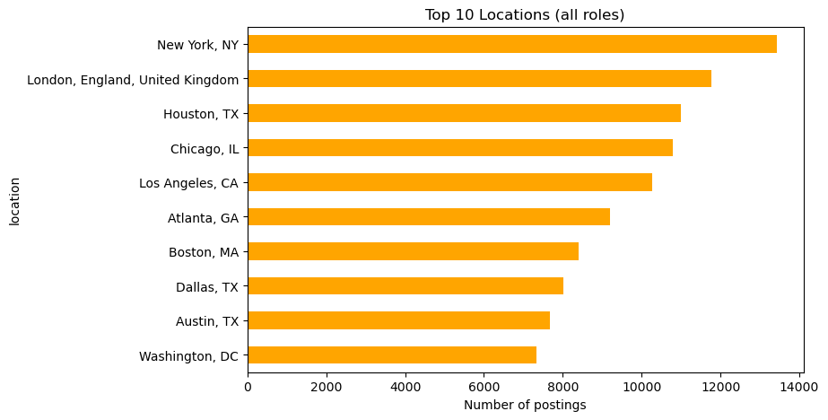
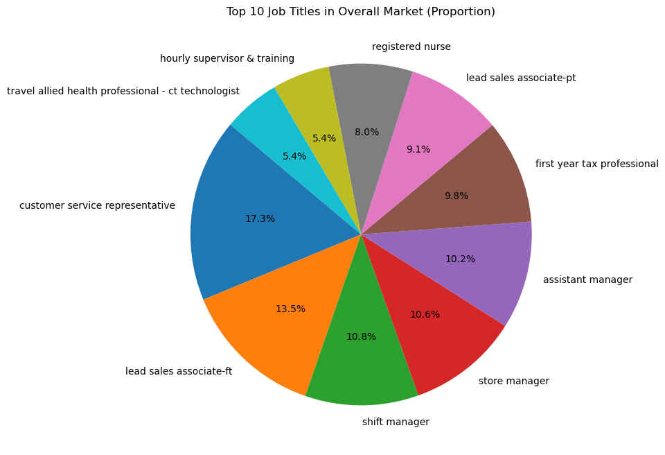
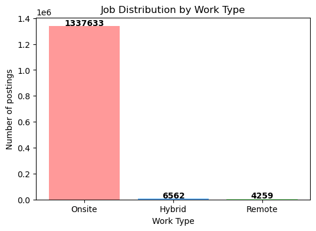
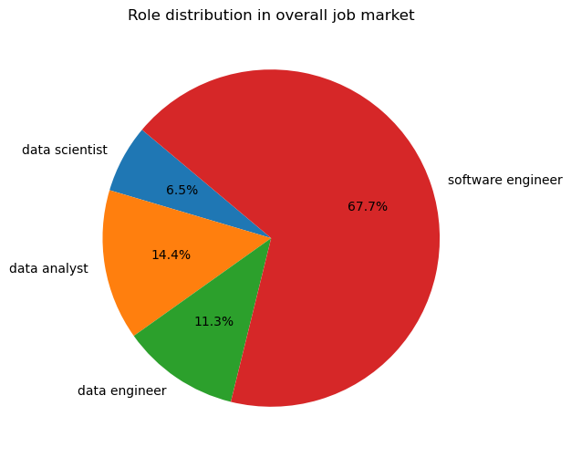
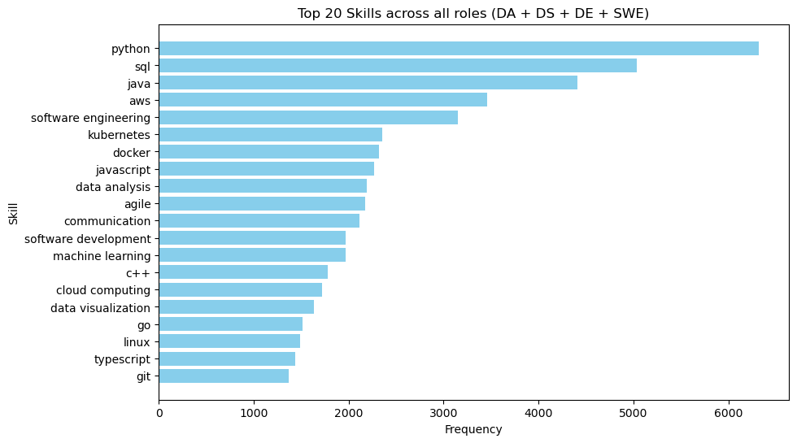
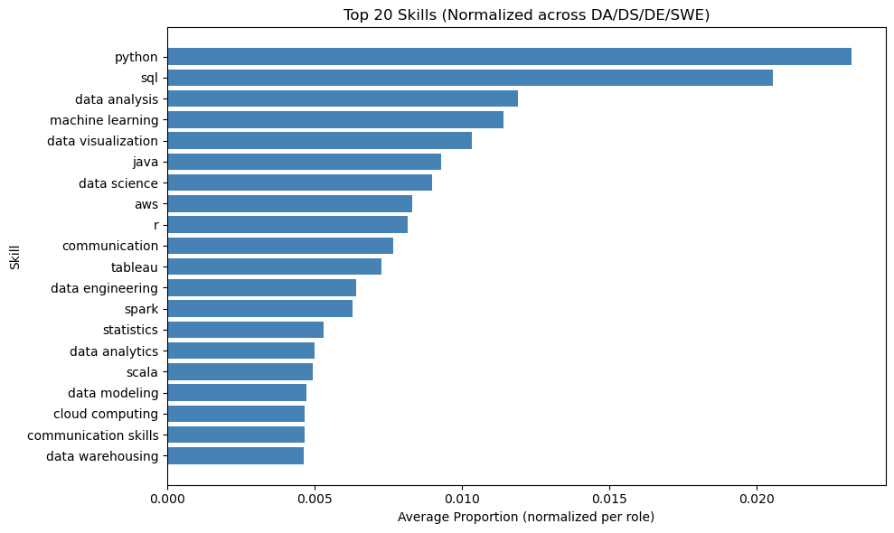
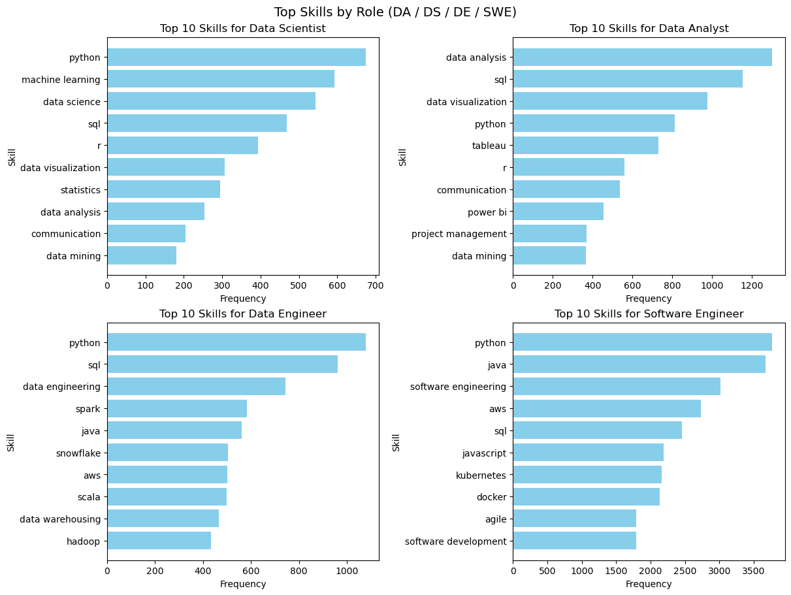
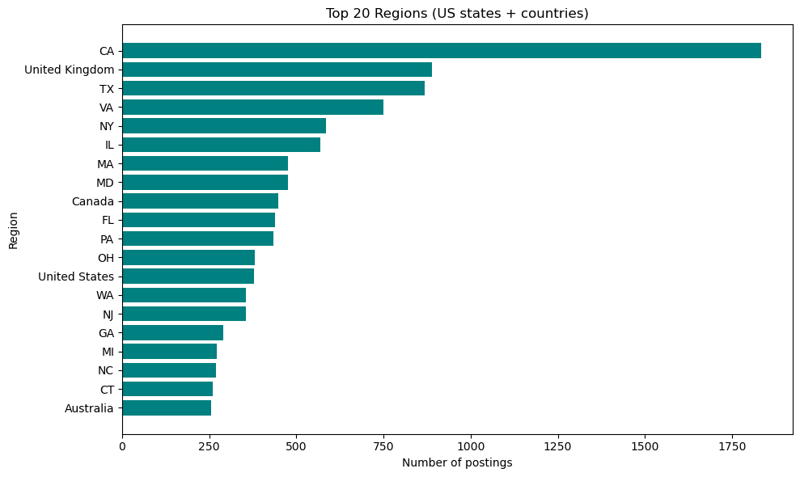

[](https://github.com/JayWu0512/duke-mids-courses/actions/workflows/LinkedIn_Jobs_&_Skills_Analysis-ci.yml)
# LinkedIn Jobs & Skills Analysis

This project focuses on analyzing job postings for Data Analyst (DA), Data Scientist (DS), Data Engineer (DE), and Software Engineer (SWE) roles.
The main objective is to identify the key skills required both overall and role-specific, and to explore the top hiring locations.

By combining a structured data pipeline (Polars) with exploratory analysis and visualization (Pandas), this study provides insights into what skills are most in demand and where opportunities are concentrated.
The findings can help job seekers adjust their learning priorities and job search strategies more effectively.

## Project Structure

```
data/
├── raw/                      # Original Kaggle parquet files
│   ├── job_skills.parquet
│   ├── job_summary.parquet
│   └── linkedin_job_postings.parquet
├── bronze/                   # Cleaned + normalized
│   └── jobs.parquet
├── silver/                   # Role-filtered + text-joined
│   └── jobs_text.parquet
├── gold/                     # Aggregated skills & final outputs
│   └── role_skills_by_title.parquet
└── test/                     # Tiny test data (generated by script)
    ├── tiny_jobs.parquet
    ├── tiny_jobs_text.parquet
    └── tiny_top_skills_by_role.parquet

notebooks/
├── 01_eda.ipynb              # Exploratory analysis of LinkedIn job postings.
└── 02_insights.ipynb         # Skill-focused analysis across DA, DS, DE, and SWE roles.

scripts/
├── download_kaggle.py        # Kaggle download & parquet conversion
├── make_test_data.py         # Generate stratified test parquet
└── test_file_test.py         # Example test script

src/
├── app/                      # Pipeline orchestration (Typer CLI)
│   ├── __init__.py
│   ├── cli.py
│   └── pipeline.py
├── domain/                   # Ports/abstractions
│   └── ports.py
├── infra/                    # IO adapters, transformers, aggregators
│   ├── __init__.py
│   ├── aggregators.py
│   ├── io_polars.py
│   └── transformers.py
├──  utils/                   # Helpers & config
│   ├── __init__.py
│   └── config.py
└── settings.py               # Control roles and dataset information

tests/
├── integration/
│   └── test_pipeline_smoke.py
├── unit/
│   ├── test_filter_and_derive.py
│   └── test_io_and_schema.py
└── conftest.py

.devcontainer/                # VS Code devcontainer config
  └── devcontainer.json

Dockerfile                    # Build project container
docker-compose.yml            # Orchestrate services (build + test)
Makefile                      # Common commands (install, test, clean)
requirements.txt              # Dependencies
pytest.ini                    # Pytest config
.flake8                       # Flake8 linting config
.gitignore                    # Git ignore rules
.dockerignore                 # Docker ignore rules
README.md                     # Project documentation
```

## Data Source
- Job postings dataset (CSV/Parquet) with fields including **title, company, location, work_type, seniority, and listed skills**.
- Dataset is filtered to a manageable slice for computation in the notebooks.

## Pipeline

The pipeline builds multiple layers of data:

1. **Raw** → Original Kaggle parquet files.  
2. **Bronze** → Cleaned and normalized schema.  
3. **Silver** → Role-filtered, text-joined job postings.  
4. **Gold** → Aggregated top skills.  

Run with:

```bash
make build
```

Outputs will be written into `data/bronze/`, `data/silver/`, and `data/gold/`.

## Notebooks

- **01_eda.ipynb**:  
Exploratory analysis of LinkedIn job postings.
Includes missing value checks, role and work type distributions, top hiring locations/companies, and monthly posting trends.

- **02_insights.ipynb**:  
Skill-focused analysis across DA, DS, DE, and SWE roles.
Covers overall and role-specific top skills, normalized comparisons, and geographic distribution (US states + countries).

## Analysis Steps

### 1. Exploratory Data Analysis (`01_eda.ipynb`)
- **Health checks** on missing values.  
- **Top 10 Hiring Companies and Job Locations (All Roles)**



- **Top 10 Job Titles in Overall Market (Proportion)**



- **Job Distribution by Work Type**



### 2. Insights (`02_insights.ipynb`)
- **Health checks** on missing values.
- **Role distribution in overall job market**


- **Top 20 Skills across all roles (DA + DS + DE + SWE)**


- **Top 20 Skills (Normalized across DA/DS/DE/SWE)**


- **Top Skills by Role (DA / DS / DE / SWE)**


- **Top 20 Regions for DA, DS, DE, SWE (US states + countries)**



## Insights
- Software engineering roles outweigh DA, DS, and DE positions combined. If you aim for more technical jobs, it is beneficial to strengthen your computer science skills, as this will increase your chances of landing a role.
- Python and SQL are consistently the two most critical languages. Building strong expertise in these will significantly improve your competitiveness in the job market.
- Each role comes with different requirements. It is essential to plan your own learning roadmap and, most importantly, highlight these skills clearly on your resume to maximize your chances of passing ATS (Applicant Tracking System) screening.

---

## Setup Instructions

You can run this project in multiple ways:

### 0. Download dataset (if needed)
```bash
python scripts/download_kaggle.py
```

### 1. Local environment
```bash
make install
```
This installs all dependencies from `requirements.txt`.

### 2. Devcontainer (VSCode)
- Open the `IDS706/` folder in VSCode.  
- Reopen in **Dev Container** (uses `.devcontainer/devcontainer.json`).  
- Dependencies will be auto-installed.  

### 3. Docker (alternative)
Build and run inside Docker:

```bash
docker compose up --build
```

This will:
- Build the container using the `Dockerfile`  
- Run `scripts/make_test_data.py` to generate tiny test parquet files  
- Run `pytest` automatically  

---

## Running Tests

### Locally
```bash
make test
```

### In CI/CD
This project includes a GitHub Actions workflow (`.github/workflows/ids706-ci.yml`).  
Every push or pull request to `IDS706/` will:
- Install dependencies  
- (Optionally) lint code  
- Run unit and integration tests with coverage reporting  

---

## Project Goals and Results

- **Goal**: Analyze LinkedIn job postings for Data Analyst, Data Scientist, Data Engineer, and Software Engineer roles to identify in-demand skills and hiring patterns. The ultimate purpose is to help job seekers plan their learning path and job search strategies more effectively. 
- **Results**:  
  - Built a multi-layer data pipeline (raw → bronze → silver → gold) to clean and standardize job postings
  - Integrated skills data with job postings, enabling role-specific skill extraction 
  - Derived work type (onsite, hybrid, remote) and seniority levels from text, improving data completeness
  - Identified top skills overall (e.g., Python, SQL) and role-specific skills (e.g., Tableau for DA, ML for DS, Spark/AWS for DE, Java/C++ for SWE) 
  - Normalized results to avoid SWE dominance, ensuring fair comparison across DA/DS/DE/SWE
  - Key insight:
    1. Python and SQL dominate across all roles
    2. Software engineering postings outweigh DA/DS/DE combined
    3. Each role has unique skills, making a personalized study roadmap and resume tailoring critical for ATS success

These results show how structured pipelines and targeted analysis can provide practical, career-oriented insights into the job market.
